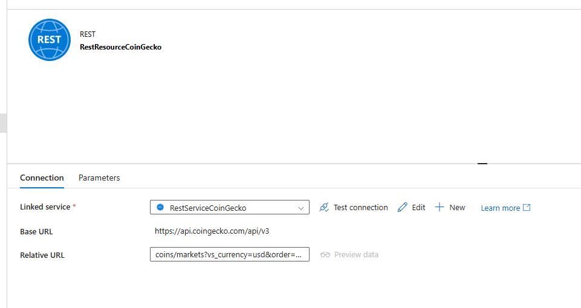

# Project: Real-Time Crypto Data Pipleline with Azure Data Factory and CoinGecko API

## Project Overview:

This project demonstrates how to build an end-to-end ETL pipeline using Azure Data Factory (ADF) to extract live cryptocurrency market data from the CoinGecko REST API, transform the JSON response, and store the results in an Azure SQL Database. Configure an automated trigger in Azure Data Factory to extract data from the CoinGecko API on an hourly schedule and update the records in the Azure SQL Database

### Project Goal: Fetch live crypto market data (top 100 coins by market cap) from CoinGecko API and transform the json file and store it in Azure SQL DB  

## Step 1: Create CoinGeko Account and request AKI Key

- Create an account and login to the CoinGeko  https://www.coingecko.com/
- Go to 'View Developer Dashboard' and create a new API Key (**Note One API Key allowed per Demo account**)
  
- Here is the documnetation for creating an API Key https://support.coingecko.com/hc/en-us/articles/21880397454233-User-Guide-How-to-sign-up-for-CoinGecko-Demo-API-and-generate-an-API-key  
  
- The Root Url is mentioned in the documentation 

## Step2: Create Azure SQl Database and configure the Database table using Azure Data Studio

- Create the Azure SQL Database in the Azure Portal
- Once our Database is created select 'Open in Azure Data Studio'  
  
- Connect to your database use your SQL credentials and create the table that will hold our CoinGeko Rest API data  
  

## Step 3: Configure Azure Data Factory to ingest the Data from CoinGeko and store it in our Azure SQL Database

### Create Linked services ADF - CoinGeko API 
- Create a linked service or your CoinGeko Rest API inside Azure Data Factory
- Open Linked services and select Rest  
 
- Add our base URL -> https://api.coingecko.com/api/v3
- Authentication Type: select Anonymous
- In Auth Headers select 'API' from the drop down list
- Enter your API key here or Connect to Azure Key Valut were your API secret is stored (**this will require another linked service with ADF**)
- Run a Test Connection and confirm it is working  
  
  

### Create Linked Service ADF - Azure SQL Database
- Select create a new linked service and select Azure SQL Database  
 
- Fill in the details AZ subcription, server aname and the table we created earlier and fill in your username and password for your AZ SQL DB
- **Note: make sure your endpoint is added to the firewall rules**
- Test connection  
 

### Create Datasets for the CoinGeko REST Data Source and Azure SQL Database
- **Step 1: Create the REST Dataset (Source)**
- In ADF, go to Author → Datasets → + New Dataset
- Choose REST as the connector
- Name it: RestResourceCoinGecko
- Linked Service: Select your REST linked service (created earlier)
- Configure the Realtive path  (This realtive path configures the request for the top 100 crypto coins )
- **REALATIVE URL: coins/markets?vs_currency=usd&order=market_cap_desc&per_page=100&page=1**  
  

- **Step 2: Create the SQL Dataset (Sink)**
- Go to Author → Datasets → + New Dataset
- Choose Azure SQL Database
- Linked service: Select your SQL linked service
- Table: Choose dbo.CoinGeckoTable
- 

Relative URL:
### Create ADF Pipeline
- Author -> New Pipeline -> Select Copy
- Under Move and Transform --> Drag Copy Data onto the canvas
- In the Source tab Select the Linked Service for the CoinGecko Rest API
- Select 'Get' for Request Method (It is defualt but make sure its selected)  
 
- In the Sink tab select the Azure SSQL DB linked service  
 

### Mapping tab - Pipeline
- The Mapping tab within a Copy Activity is used to define how fields from the source (REST API CoinGecko) are mapped to columns in the sink (Azure SQL Database table).
- **Note: I had to perform this manually, I was getting errors when I tried to automatically map these fields**  
  
- Ensure type compatibility between source data types and sink schema
- Flatten nested JSON fields into tabular structure
- The last_updated field was not available so I had to remove that from the Azure SQL DB side
- There was no field last_upadted in the mapping tab so I removed the last_updated field and added a new last_updated field which updates the time of data ingestion  
  
  
  

### Setup an hourly trigger for 24 hours
- this Trigger will ingest data from the CoinGecko REST API and store the data in the Azure SQL DB every hour for 24 hours  
  
- Run your trigger

## Step 3: Check your table has been updated in Azure Data Studio  
  
